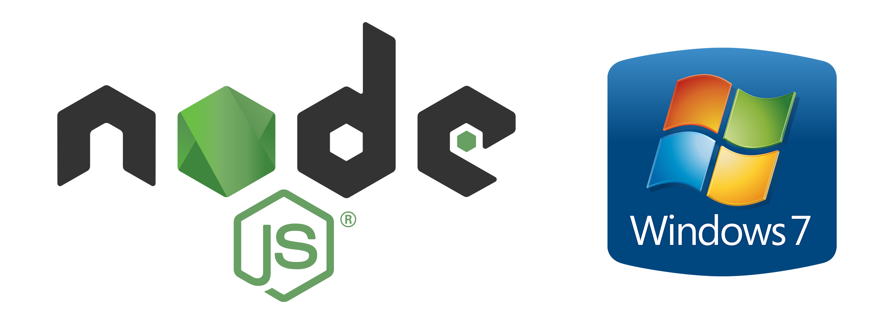

# Node.js 14+ for Windows 7

This repository contains installers of Node.js 14 and newer versions for Windows 7 and the source code of the Node.js runtime environment which is adapted for Windows 7 with the instructions on how to build it.

## Introduction

Node.js is a popular back-end JavaScript runtime environment which executes JavaScript code outside a web browser. Node.js has been continuously evolving since its inception. However, one significant change that recently occurred in Node.js was the drop of support for Windows 7. After version 13.6, [Node community stopped providing Windows 7 compatibility](https://github.com/nodejs/node/pull/31954) right in the middle of the development phase even without leading Node.js to its logical conclusion for this operating system in the form of the v14 LTS release.

## Theoretical background

Starting with version 14, Node.js introduced dependencies on newer Windows API functions that are not available in Windows 7. Unfortunately, new WinAPI calls are the main reason that breaks compatibility with Windows 7: the necessary functions are either completely missing or their older implementations may deviate from the behaviour expected by ```V8``` or ```libuv```, leading to subtle runtime failures. To make newer versions of Node.js work on Windows 7, two solutions exist: 

1) Functions missing entirely from Windows 7 can be emulated through custom implementations or reconstructed using legacy APIs. This solution is good for functions that have no direct analogue in Windows 7 but whose behaviour can be recreated with reasonable effort.

2) The unavailable function can be simply replaced with an equivalent legacy function in case a similar Windows API function exists in Windows 7.

Both methods are applied selectively based on the specific context and the nature of the missing functionality.

## Building

The building instructions for different versions of Node.js are different. Each folder with each Node.js version has its own building instructions.

## Where compatibility problems may arise

**The core Node.js interpreters and the standard Node.js libraries run correctly on Windows 7.** Nothing is cut or modified in Node.js itself, and the interpreters in these installers read the code in the same exact way as the interpreters in the official installers. However, in the future, you may experience compatibility issues with ```npm``` packages. The reason is that developers of these packages may drop support for Windows 7 considering that officially Node.js 14 and newer versions are not intended for this operating system. I cannot provide any help with such kind of trouble because I have no control over thousands of Node.js software packages. In this case, I recommend contacting the developer of the specific package which causes the compatibility issue.

## Why only even versions are present

This is the peculiarity of the release schedule of Node.js. According to [the release plan by Node.js Release Working Group](https://github.com/nodejs/release#release-schedule), only even-numbered major versions have been determined to be appropriate and stable for the release line. Even-numbered versions transition to long-term support and are actively maintained. Odd versions are not published here because they are not promoted to long-term support, not maintained and not recommended for most users.

### See also: [Python 3.9+ for Windows Vista and Windows 7](https://github.com/vladimir-andreevich/cpython-windows-vista-and-7)
